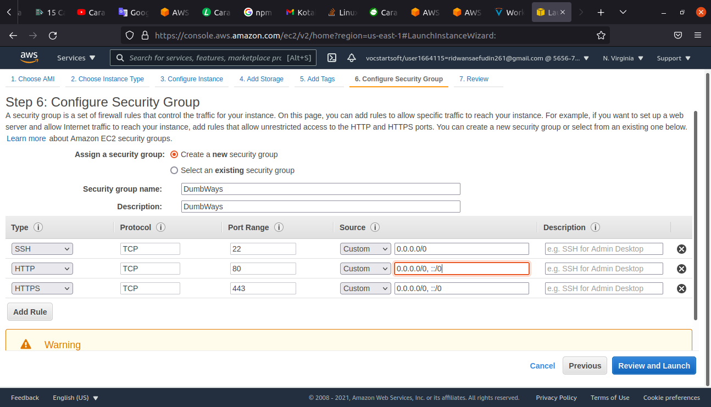

# 1. VMWare - Install Ubuntu Server
**Cara install ubuntu server di vmware/virtualbox**
 
1. Buka virtualbox/vmware dan setting resource yang dibutuhkan mulai dari besaran ram dan kapasitas hardisk yang digunakan 
2. Setting Network ke Bridge dan masukkan cd untuk menginstall ubuntu server 

 

 

 

 

 

 

 

 

 

3. Pilih language dan setup keyboard  

 

 

4. Setting IP address ke manual dan jadikan ip static dengan memilih IPv4  

 

 

 

 

 

5. Setting partisi yang akan digunakan, disini saya membagi 1GB untu swap dan alokasikan sisa memory untuk root  

 

6. Setting nama, server name dan password yang akan digunakan pada saat pertama kali akses atau mencoba untuk login

 

 

 
 
7. Tunggu Hingga Proses intallasi ubuntu server selesai dan reboot system agar bisa digunakan

 

  

# 2. VMWare - Setup Network
**Cara Setup Network/IP Address ke static**
 

1. saya login dengan user ridwansaefudin dan membuat user baru dengan perintah adduser untuk user dengan nama ridwan dan juga setting password  

 

2. Saya telah berhasil membuat user baru dan login dengan nama user ridwan  

 

3. dengan perintah sudo nano /etc/sudoers atau perintah sudo -aG sudo ridwan, saya setting agar dapat mengakses hak istimewa root  

 

4. ifconfig untuk melihat alamat ip yang digunakan dan perintah sudo /etc/netplan untuk merubah alamat ip address 

 

 

5. Perintah netplan apply untuk dapat menggunakan ip address yang telah diubah dan reboot untuk dapat mengubah alamat ip yang sudah di setting sebelumnya

 

 

 

6. coba untuk mengetes alamat ip lokal ke ubuntu server, begitupun sebaliknya dengan perintah ping  

 

# 3. VMWare - Install Application
**Cara mengsetup dan mendeploy aplikasi nodeJS ke server**
 

  

  

  

  

  

  

  

  

  

  

  

  

  

  

  

# 4. AWS - Create and Setup Server
 

  

  

  

  

  

  

  

  

  

# 5. AWS - Server for Application
 

**Saya sudah buat tapi belum dirapihkan folder foto(Saya harap dan tolong untuk beri saya kesempatan memperbaiki)**
